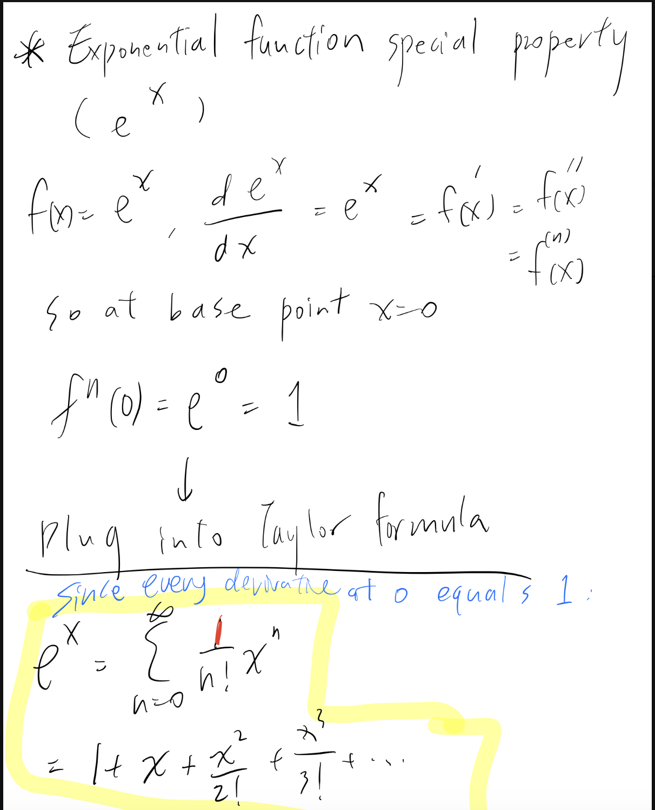
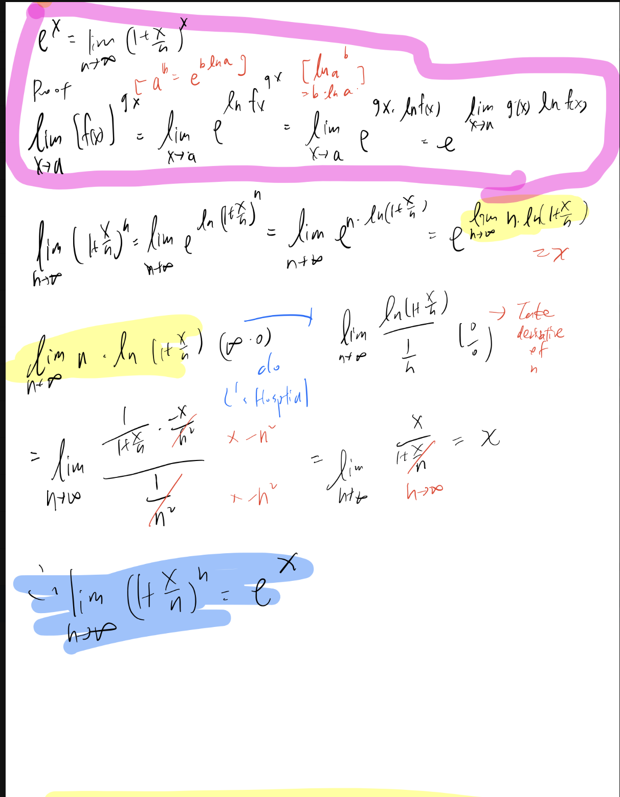
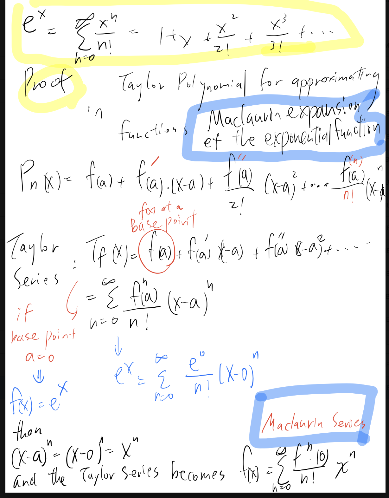

# TaylorMaclaurin-ExpandedPINN

| CHEMENG 236.        | This paper                                        |
| ------------------- | ------------------------------------------------- |
| \(u_\theta(x,t)\)   | predicted concentration profile                   |
| data                | experimental/numerical concentration measurements |
| governing equation  | chemical-reaction ODEs                            |
| physics residual    | kinetic ODE residual                              |
| collocation points  | unmeasured time points                            |
| \(\theta\)          | neural-network parameters                         |
| optimization        | ADAM/backpropagation                              |
| physics constraint  | reaction kinetics / mass balances                 |

| Paper notation               | Our notation          | Meaning                    |
| ---------------------------- | --------------------- | -------------------------- |
| \(u(x,t)\)                   | \([A]_\theta(t)\)     | predicted physical state   |
| \(\lambda\)                  | \(\lambda\)           | kinetic/process parameters |
| \(\mathcal N[u,\lambda]\)    | \(-f([A],t;\lambda)\) | governing physics          |
| \(\frac{d[A]}{dt}=f([A],t)\) | chemical ODE          | reaction kinetics          |
| \(f_\theta(t)\) in Eq. (3)   | \(r_\theta(t)\)       | physics residual           |
| \(f_\theta(t)=0\)            | \(r_\theta(t)=0\)     | physics satisfied          |
| —                            | \(h(u_\theta)=0\)     | equality constraint        |

# How it deal with error propagation , How broad is the work , level of accuracy and does it translate to harder problems? 
- Error Propagations 1. Data measurement noise 2. Temporal error accumulation. 3. model-form / Taylor truncation error.
- Broadness: dynamic reaction kinetics+process-condition variation​
- Accuracy: 
SubR:^2 > 0.79, RMSE = 0.05 for iron-catalyzed cycloaddition
Prod:R^2 > 0.75, RMSE = 0.05 for iron-catalyzed cycloaddition-
-  Does it translate to harder problems?
simple kinetics→catalytic network→intermediate species→multivariate conditions→oscillatory dynamics. 
However, the paper gets some of its robustness by simplifying the hard problem.

| Question                               | Assessment                                |
| -------------------------------------- | ----------------------------------------- |
| Noise robustness                       | **Moderate–good**                         |
| Formal uncertainty propagation         | **Weak / not addressed**                  |
| Accuracy inside sampled design space   | **Very good**                             |
| New combinations within sampled ranges | **Good, but variable**                    |
| Extrapolation outside sampled range    | **Poorly supported**                      |
| Limited-data performance               | **Promising**                             |
| Multivariate process conditions        | **Yes**                                   |
| Oscillatory dynamics                   | **Demonstrated**                          |
| Strongly stiff CRNs                    | **Partly avoided through simplification** |
| Mechanism discovery                    | **No**                                    |
| Reaction-order identification          | **No**                                    |
| General industrial process surrogate   | **Promising**                             |
| Arbitrary complex reaction solver      | **Not demonstrated**                      |

Its strongest use case is:

$$ \text{limited experiments} + \text{known reasonable process range} + \text{concentration-time data} + \text{process-condition optimization}. $$

Its weakest use case is:

$$ \text{high-dimensional parameter space} + \text{strong stiffness} + \text{poorly sampled fast dynamics} + \text{large extrapolation} + \text{need for mechanistic or uncertainty inference}. $$

## Augmented PINN with PyTorch

Implement this "Augmented PINN" concept using standard PyTorch. Even without the paper's exact codebase, you can easily implement this "Augmented PINN" concept using standard PyTorch. 

Instead of treating the kinetic rate constant $k$ as a fixed number, you define the coefficients of its Taylor expansion as `nn.Parameter` (trainable variables). The neural network will learn these coefficients at the same time it learns the concentration profiles.

## 1. The Mathematical Connection to Chemical Kinetics

### The Exponential Foundation ($e^x$)
In chemical kinetics, the simplest ordinary differential equation (ODE) is a first-order reaction: 
$$\frac{d[A]}{dt} = -k[A]$$

The analytical solution to this ODE is an exponential function: 
$\left\[A\right](t) = [A]_0 e^{-kt}$
This is why $e^x$ is the backbone of modeling concentration profiles over time.

### Taylor Series in the PINN Paper
*"Kinetic parameters are approximated using truncated Taylor series expansions."*

In real chemistry, the rate constant $k$ isn't just a static number; it changes based on external conditions like temperature (often governed by the Arrhenius equation, which also features $e^x$). If the exact physical equation is unknown or too complex, the Augmented PINN uses a Taylor series to approximate how the rate constant $k$ behaves around a reference state.

## The Mathematics: Taylor Series Expansion

The general formula for a Taylor series (specifically a Maclaurin series, which is centered at $x = 0$) for a function $f(x)$ is:
$$f(x) = \sum_{n=0}^{\infty} \frac{f^{(n)}(0)}{n!} x^n = f(0) + f'(0)x + \frac{f''(0)}{2!}x^2 + \frac{f'''(0)}{3!}x^3 + \dots$$

Here is where your two properties act toghether for the expansion:

* **The Derivative Property ($\frac{d}{dx}e^x = e^x$):** This means that the first derivative, second derivative, third derivative, and every $n$-th derivative of $f(x)$ is simply $e^x$. So, $f^{(n)}(x) = e^x$.
* **The Initial Value Property ($e^0 = 1$):** Because we evaluate the derivatives at $x = 0$, every single coefficient numerator becomes $f^{(n)}(0) = e^0 = 1$.

Plugging $1$ into every numerator of the general formula gives us the beautiful, simple series for $e^x$:
$$e^x = 1 + x + \frac{x^2}{2!} + \frac{x^3}{3!} + \frac{x^4}{4!} + \dots = \sum_{n=0}^{\infty} \frac{x^n}{n!}$$

### 2. Connecting the Math to the ODE (Equation 10 & 11)

The general Taylor series maps directly to the PINN's chemical rate functional ($K_F$) as it changes with temperature ($T$).

* **Math World ($x$):** The variable under evaluation.
* **Chemistry World ($T$):** The actual temperature of the reaction (e.g., **35°C**).
* **Math Base ($a$):** The chosen reference point.
* **Chemistry Base ($T_0$):** The standard reference temperature (e.g., room temperature, **25°C**).
* **Math Delta $(x - a)$:** The distance from the base.
* **Chemistry Delta $(\Delta T)$:** The difference between the actual and reference temperature $(T - T_0)$.

Substituting the chemical parameters into the general Taylor series yields the exact transformation applied to the ODEs:

$$K_F(T) \approx K_F(T_0) + K_F'(T_0)(T - T_0) + \frac{K_F''(T_0)}{2!}(T - T_0)^2$$

---

### 3. Application of the Taylor Series in PINN Implementation

In applied chemical kinetics, the exact, complex equation governing a catalyst's behavior at an arbitrary temperature (e.g., **35°C**) is often unknown. However, experimental data is typically available for its behavior at a base state, such as **25°C** ($T_0$).

Instead of requiring the neural network to learn the entire complex Arrhenius equation from scratch, the Augmented PINN leverages the Taylor series approach:

> By establishing the baseline reaction rate at **25°C**, the neural network is trained to learn only the derivatives (the coefficients). This allows the model to predict how the reaction rate shifts when the system deviates from the baseline temperature.

In a PyTorch implementation, these Taylor series derivatives ($K_F(T_0)$, $K_F'(T_0)$, etc.) serve directly as the `nn.Parameter` weights optimized during training. The algorithm adjusts these weights until the $(T - T_0)$ polynomial expansion aligns precisely with the noisy experimental data.

---

## Limit Definition of the Exponential Function and mathematical proof

The most common and rigorous way to prove this is by using the natural logarithm and L'Hôpital's rule.

**Theorem:**
$$e^x = \lim_{n \to \infty} \left(1 + \frac{x}{n}\right)^n$$

**Proof:**

**Step 1: Set up the limit and apply the natural logarithm.**
Let $L$ be the value of the limit:
$$L = \lim_{n \to \infty} \left(1 + \frac{x}{n}\right)^n$$

Take the natural logarithm ($\ln$) of both sides. Because the natural logarithm is a continuous function, we can pass it inside the limit:
$$\ln(L) = \ln\left( \lim_{n \to \infty} \left(1 + \frac{x}{n}\right)^n \right)$$
$$\ln(L) = \lim_{n \to \infty} \ln\left( \left(1 + \frac{x}{n}\right)^n \right)$$

**Step 2: Use logarithm properties to rearrange the expression.**
Using the power rule for logarithms, bring the exponent $n$ down:
$$\ln(L) = \lim_{n \to \infty} n \ln\left(1 + \frac{x}{n}\right)$$

As $n \to \infty$, this expression evaluates to $\infty \cdot 0$, which is an indeterminate form. To use L'Hôpital's rule, rewrite it as a fraction in the form $\frac{0}{0}$:
$$\ln(L) = \lim_{n \to \infty} \frac{\ln\left(1 + \frac{x}{n}\right)}{\frac{1}{n}}$$

**Step 3: Apply L'Hôpital's Rule.**
Take the derivative of the numerator and the denominator with respect to $n$:

* **Derivative of the numerator** (using the chain rule):
    $$\frac{d}{dn} \ln\left(1 + xn^{-1}\right) = \frac{1}{1 + \frac{x}{n}} \cdot \left(-\frac{x}{n^2}\right)$$
* **Derivative of the denominator:**
    $$\frac{d}{dn} (n^{-1}) = -\frac{1}{n^2}$$

Substitute these derivatives back into the limit:
$$\ln(L) = \lim_{n \to \infty} \frac{ \left( \frac{1}{1 + \frac{x}{n}} \right) \left( -\frac{x}{n^2} \right) }{ -\frac{1}{n^2} }$$

**Step 4: Simplify and evaluate the limit.**
Cancel the common $-\frac{1}{n^2}$ terms from the numerator and denominator:
$$\ln(L) = \lim_{n \to \infty} \left( \frac{1}{1 + \frac{x}{n}} \right) \cdot x$$
$$\ln(L) = \lim_{n \to \infty} \frac{x}{1 + \frac{x}{n}}$$

Now, evaluate the limit as $n$ approaches infinity. The term $\frac{x}{n}$ approaches $0$:
$$\ln(L) = \frac{x}{1 + 0} = x$$

**Step 5: Solve for $L$.**
We have established that $\ln(L) = x$. To find $L$, exponentiate both sides:
$$e^{\ln(L)} = e^x$$
$$L = e^x$$

Substituting $L$ back with our original limit expression, the proof is complete:
$$\lim_{n \to \infty} \left(1 + \frac{x}{n}\right)^n = e^x$$

### Exponential Base Point

### Intermediate Form

### Polynomial Approximation

